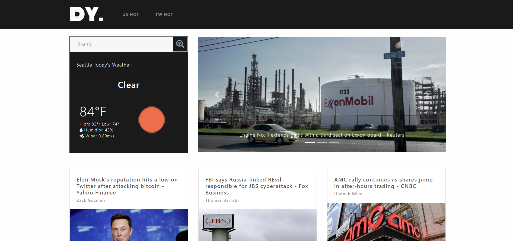
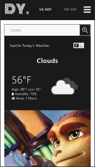

# DY NEWS

## Description

An app that you can read the US and Taiwan hottest & latest news at the same time

### On Phone

## Languages

React, TypeScript, Redux

## API used

[openweathermap-API](https://openweathermap.org/api)
,[newsapi](https://newsapi.org/)

## Repositories

- Deploy Page: https://danielyu0864.github.io/DY-news/
- Project Github: https://github.com/DanielYu0864/DY-news

## Authors

[Daniel Yu](https://github.com/DanielYu0864)
